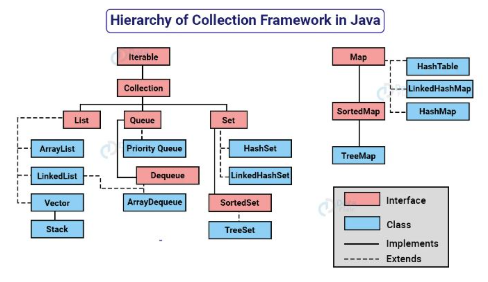

# Collections em Java

Conteúdo desenvolvido durante o estudo de java na plataforma DIO, oferecido pela Claro.

## Collections

Uma collection é uma estrutura de dados que serve para agrupar muitos elementos em uma única unidade. Estes elementos precisam ser OBJETOS!

Uma collection pode ter coleções homogêneas e heterogêneas.

São 4 grandes tipos de coleções: List, Set, Queue e Map.

#

 
Obs: Todas as interfaces e classes são encontradas dentro do pacote java.util

Embora Map não seja filha da interface collection, também é considerada uma coleção devido a sua função.

### Generics Type

Um tipo genérico é uma classe genérica ou uma interface que é parametrizada em relação a tipos

## Comparable x Comparator

### Comparable

Fornece uma única sequência de ordenação. Em outras palavras, podemos ordenar a coleção com base em um único elemento.

- Afeta a classe original;
- Fornece o método compareTo() para ordenar elementos;
- Está presente no pacote java.lang;
- Podemos ordenar os elementos da lista do tipo Comparable usando o método Collections.sort(List).

### Comparator

Fornece múltiplas sequências de ordenação. Em outras palavras, podemos ordenar a coleção com base em múltiplos elementos.

- Fornece o método compare();
- Não afeta a classe original;
- Está presemte no pacote java.util;
- Podemos ordenar os elementos da lista do tipo Comparator usando o método Collections.sort(List, Comparator).

### Collections

É uma classe utilitária do java para operações comuns em coleções.

- Fornece métodos para ordenação, busca, manipulação e sincronização de coleções;
- O método sort() é usado para ordenar uma lista em ordem ascendente;
- o método sort() em conjunto com Collections.reverseOrder() permite ordenar em ordem descendente.

## Interface List

List é uma ocleção ordenada que permite a inclusão de elementos duplicados.

- Classes de implementação comuns são ArrayList e LinkedList;
- Assemelha-se a uma matriz com comprimento dinâmico;
- Fornece métodos úteis para adicionar elementos em posições específicas, remover ou substituir elementos com base no índice e obter sublistas usando índices;
- A classe Collections fornece algoritmos úteis para manipulação de List, como ordenação (sort), embaralhamento (shuffle), reversão (reverse) e busca binária (binarySearch).

### ArrayList

O ArrayList é uma implementação da interface List que armazena os elementos em uma estrutura de array redimensionável. Isso significa que ele pode crescer automaticamente à medida que novos elementos são adicionados. A principal vantagem do ArrayList é o acesso rápido aos elementos por meio de índices, o que permite recuperar um elemento específico de forma eficiente. No entanto, adicionar ou remover elementos no meio da lista pode ser mais lento, pois requer a realocação de elementos.

### LinkedList

O LinkedList é uma implementação da interface List que armazena os elementos em uma lista duplamente vinculada. Cada elemento contém referências para o elemento anterior e próximo na lista. A principal vantagem do LinkedList é a eficiência na adição ou remoção de elementos no início ou no final da lista, pois não é necessário realocar elementos. No entanto, o acesso aos elementos por meio de índices é mais lento, pois requer percorrer a lista até o elemento desejado.

### Vector

O Vector é uma implementação antiga da interface List que é semelhante ao ArrayList, mas é sincronizada, ou seja, é thread-safe. Isso significa que várias threads podem manipular um objeto Vector ao mesmo tempo sem causar problemas de concorrência. No entanto, essa sincronização adiciona uma sobrecarga de desempenho, tornando o Vector menos eficiente do que o ArrayList em cenários em que a concorrência não é um problema. Por esse motivo, o uso do Vector é menos comum em aplicações modernas.

